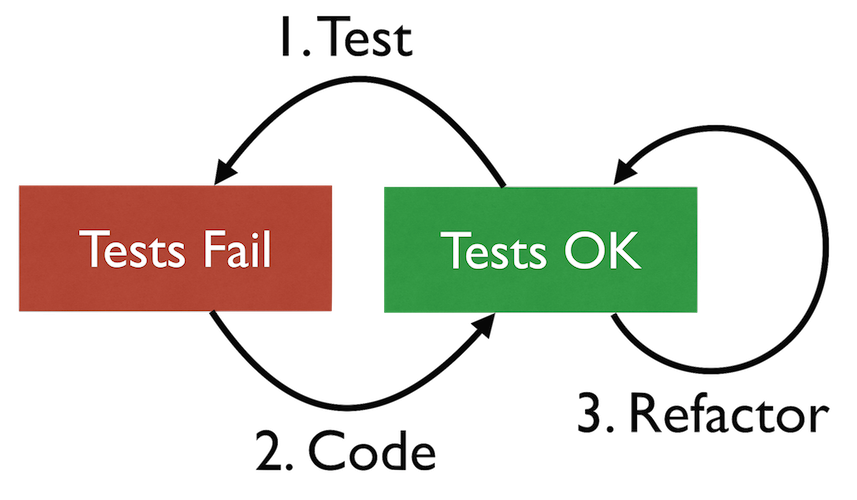

## Inner TDD Cycle: Test-Code-Refactor

###_How to add a small piece of functionality, and design as you go._

1. Add a failing test 
2. Write just enough code to make the test (and all other tests) succeed
3. Clean up code and __refactor__:
   - Remove duplication
   - Choose good names
   - Introduce abstraction (if really necessary)
   