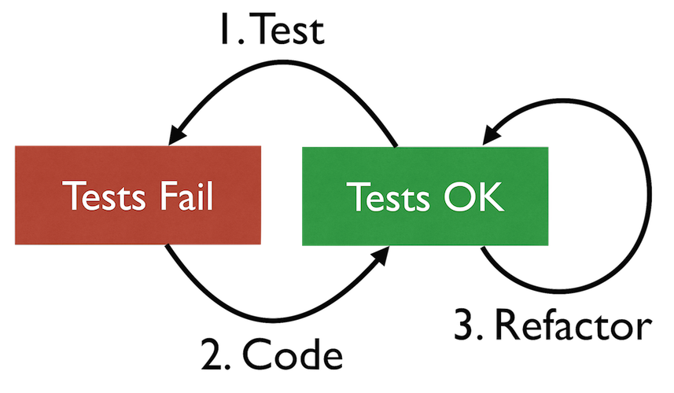

# Test-Driven Development

TDD is a development method to help you stay in control while programming 
even if the code complexity exceeds your mental capacity.

1. Developers write automated tests while they are developing code
2. Most tests come into place before the application code they check
3. Design is taking place continuously and in small steps

### Benefits of TDD

- Tests ensure current functionality does not break
- Continuous Design and Refactoring enhances the life span of software
- Adding tests in retrospective is much harder
- Small steps ensure continuous progress and regular feedback

## Inner Development Cycle: Test-Code-Refactor

1. Add a failing test 
2. Write just enough code to make the test (and all other tests) succeed
3. Clean up code and refactor:
   - Remove duplication
   - Choose good names
   - Introduce abstraction (if really necessary)

## Session Inbox

How to structure a programming session without forgetting some of the details.

1. Collect all features / ideas / tests that are necessary 
   to resolve your next programming task
2. Choose one item from the list and solve it using Test-Code-Refactor
3. Maintain inbox:
   - Add new ideas
   - Remove out-of-scope ideas
   - Add additional tasks that are necessary (e.g. refactorings)
4. If inbox has open items -> Go to 2.
5. If inbox is empty, revisit and review current code and tests

## Links

- TDD Course (Learn Test Driven Development with Python) using Mocks: 
  [Youtube Video](https://www.youtube.com/watch?v=eAPmXQ0dC7Q)
- Intro to Test-Code-Refactor cycle with simple example: 
  [Article on Rubik's Code](https://rubikscode.net/2021/05/24/test-driven-development-tdd-with-python/)
- _Testgetriebe Entwicklung: Entschlüsselt_. A free German e-book (42% done) using Groovy as programming language.
  [E-book on leanpub](https://leanpub.com/tdd-entschluesselt)